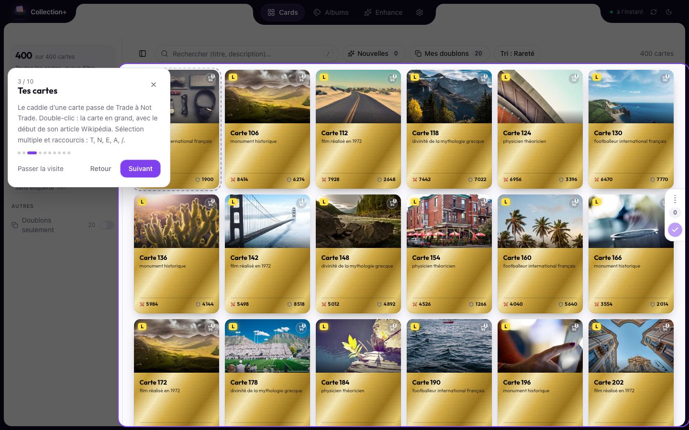
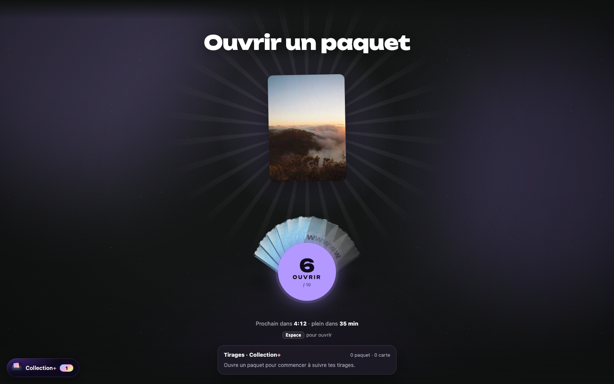
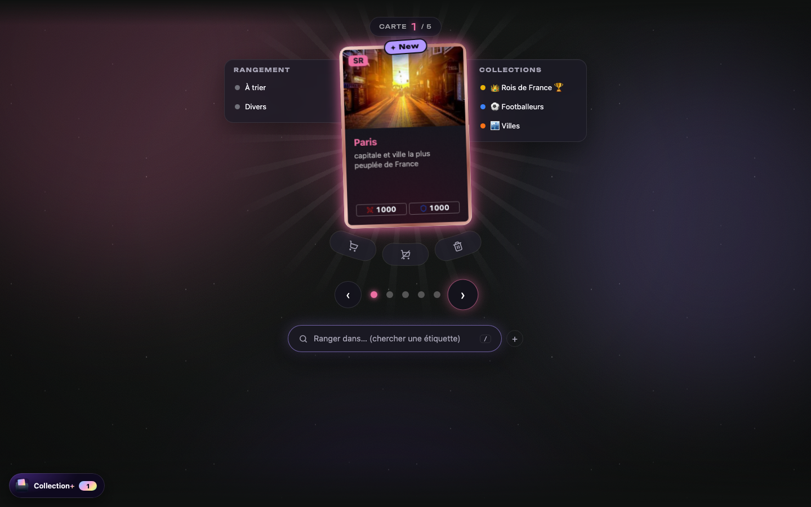

<p align="center">
  
</p>

<p align="center">
  <a href="https://github.com/EnzoBncll/wikimasters-collection-plus/releases/latest"></a>
  
  <a href="LICENSE"></a>
</p>

# WikiMasters Collection+

> Extension Chrome **non officielle** pour [WikiMasters](https://www.wiki-masters.com), sans lien avec l'équipe du jeu.

Range ta collection de cartes Wikipédia : tri **Trade / Not Trade** en quelques clics, **étiquettes** (celles du site), **albums** à feuilleter façon Panini, **albums à objectif** (les rois de France, le top 50 des…) avec les cartes qu'il te reste à trouver, ouverture des paquets redessinée sur WikiMasters, suggestions des meilleures cartes à chercher, **synchronisation entre tes ordinateurs** et **export** CSV / Google Sheets.

<p align="center">
  
  
</p>

## Fonctionnalités

- **Visite guidée** : à la première ouverture, une présentation pas à pas des quatre pages met en lumière chaque fonction. Passable, et relançable depuis **Paramètres › Apparence › Aide**.
- **Cartes** : toutes tes cartes, filtres compacts (statut, rareté, étiquettes séparées Collection / Rangement, doublons, nouvelles), sélection multiple, raccourcis clavier (`T` Trade, `N` Not Trade, `E` étiqueter, `A` tout, `/` recherche, `Entrée` afficher en grand).
- **Boîte d'envoi** : rien ne part sur le site tout de suite. Statuts, étiquettes et albums s'accumulent dans un volet à droite (poignée avec le nombre de modifications) et partent d'un clic ; un tracé aux couleurs de la palette fait le tour du cadre pendant l'envoi.
- **Cartes au style WikiMasters** : format, couleurs de rareté et statistiques du jeu, neuf habillages au choix (imprimé, premium foil, matière), reflet holographique au survol, plus intense selon la rareté.
- **Carte en grand** : la carte, ses infos et, à côté, le début de son article Wikipédia (dépliable, repliable) ; ← → pour parcourir.
- **Trade / Not Trade** : deux étiquettes natives du site, option « tout Trade par défaut », pastilles sur les cartes de WikiMasters.
- **Étiquettes et albums** : un seul bouton **Nouveau** pour une étiquette / album, un album à objectif ou une étiquette de rangement. Chaque étiquette s'ouvre en album à feuilleter, **relié** ou **classeur** : rangement à la main ou vue par rareté (sans perdre ton ordre), croix pour retirer une carte (elle passe dans « Écartées »), description de couverture rédigée par l'IA.
- **Albums à objectif** : décris ce que tu veux réunir (« les rois de France », « les empereurs en Europe après 1600 », « le top 50 des personnalités féminines françaises avant 1900 »). Collection+ cherche une page « Liste de… » de Wikipédia, une liste Wikidata notée de 0 à 1 selon les dates et le lieu, ou traduit ta phrase en règles modifiables (avec une clé Gemini gratuite, facultative). Tu verrouilles la liste, l'album prend le préfixe « ◇ » et son propre groupe en tête de la page Albums (au-dessus des collections et des rangements), avec ses cases numérotées : cartes collées, cartes possédées à coller d'un clic, cartes à trouver. Survole une carte pour voir l'article.
- **Enhance** : cartes à ranger dans tes albums, nouveaux albums possibles d'après Wikidata, fiches d'album rédigées par l'IA intégrée de Chrome.
- **Souhaits** : une page dédiée à ta liste de souhaits WikiMasters (le cœur du site) : recherche dans le catalogue pour en ajouter, filtre « À trouver » et « Chez tes amis » (qui possède la carte, pour proposer un échange), et les souhaits notés sous tes albums, à envoyer sur le site d'un clic.
- **Liste de souhaits et suggestions** : sous chaque album, les cartes les plus connues de son thème que tu n'as pas encore.
- **Export** : CSV, copie pour tableur, ou classeur Google Sheets mis en forme.
- **Doublons et défausse** : « Mes doublons » liste tes cartes en double ; les cartes marquées Discard sont défaussées depuis la boîte d'envoi, après un récapitulatif (un exemplaire toujours gardé, jamais les shiny ni les favoris).
- **Collections finies** : une étiquette terminée prend « ✓ » et la couleur or, reconnue sur tous tes appareils ; les collections finies passent en tête de la page Albums.
- **Sur WikiMasters** (chaque fonction se règle dans le popup ou Paramètres › Sur WikiMasters) :
  - page d'ouverture redessinée : bouton rond entouré de tes paquets en 3D (prêts, en charge, à venir), compteur et temps avant la réserve pleine ;
  - révélé animé par rareté avec sons, pastille « New », récap du paquet, touche Espace, révélé rapide, cartes qui respirent et habillage Collection+ ;
  - rangement sans ouvrir la carte : rangements à gauche, collections à droite, statut Trade / Not Trade / Discard en arc, recherche et création d'étiquette ;
  - album à objectif : quand la carte tirée est dans la liste, l'album sort de sa ligne et la carte s'y colle ;
  - statistiques de tirage, compteur de paquets dans l'onglet et sur l'icône, notifications (réserve pleine, pack PRO) ;
  - plein écran 3D sur les cartes, liste de souhaits mise en avant sur le marché et les échanges (cœur pour en ajouter), images libres en option.
- **Synchronisation entre ordinateurs** : albums à objectif, mises en page, cartes écartées, souhaits, règles et réglages suivent sur chaque ordinateur où tu es connecté à Chrome (synchronisation activée). Rien à configurer, aucun compte en plus ; les cartes et étiquettes, elles, sont déjà sur WikiMasters. État et bouton « Synchroniser » dans **Paramètres › Synchro et export**.
- **Popup** : bouton « Synchroniser » (dernier échange entre ordinateurs), compteur de paquets, historique et export CSV des tirages, réglages rapides et choix du thème.
- **Thèmes** : mode clair, sombre ou auto, et 10 palettes qui recolorent l'interface, le bouton sur le site et l'icône de l'extension. Sur le site, trois styles : couleur pleine, ambiance teintée ou irisé.
- **Cache local** : la collection s'affiche instantanément, seuls les changements sont rechargés.

<p align="center">
  
</p>

## Sur WikiMasters

<p align="center">
  
  
</p>

À gauche, la page d'ouverture : tes paquets en éventail, le compteur et le temps avant la réserve pleine. À droite, le révélé : la carte à l'habillage Collection+ (avec sa description, sans avoir à cliquer), les volets Rangement et Collections pour l'étiqueter d'un clic, et le statut Trade / Not Trade / Discard en dessous.

## Cartes et raretés

Au repos (en haut) et au survol (en bas), de Commun à Légendaire :

<p align="center">
  
</p>

<p align="center">
  
</p>

## Albums

<p align="center">
  
  
</p>

Sous chaque album, la liste de souhaits et les **meilleures cartes à chercher** pour son thème, classées par notoriété (nombre d'éditions de Wikipédia : plus un article est lu, plus la carte est rare).

<p align="center">
  
</p>

<p align="center">
  
  
</p>

## Palettes

Dix accords de couleurs, à choisir dans **Paramètres › Apparence › Palette**. Chacun existe en clair et en sombre.

<p align="center">
  
</p>

<p align="center">
  
</p>

<p align="center">
  
</p>


**Popup et bouton sur le site** : un clic sur l'icône ouvre Collection+ ou trie directement les nouvelles cartes. Sur WikiMasters, le bouton **Collection+** en bas à gauche indique combien de cartes attendent d'être triées.

<br clear="right">

## Installation

1. Télécharge le zip de la [dernière version](https://github.com/EnzoBncll/wikimasters-collection-plus/releases/latest) (`wikimasters-collection-plus-x.y.z-chrome.zip`).
2. Dézippe-le dans un dossier que tu gardes (ex. `Documents/Collection+`).
3. Ouvre `chrome://extensions`, active le **Mode développeur** (en haut à droite).
4. **Charger l'extension non empaquetée** → choisis le dossier dézippé.
5. Va sur WikiMasters (connecté) : un bouton **Collection+** apparaît en bas à gauche.

> Garde un onglet WikiMasters ouvert quand tu utilises Collection+ : l'extension passe par lui pour parler au site.

## Mises à jour

Collection+ vérifie les nouvelles versions et affiche **« Version x.y.z disponible »** dans l'app et le popup. Pour mettre à jour :

1. Télécharge le nouveau zip depuis la [page des versions](https://github.com/EnzoBncll/wikimasters-collection-plus/releases/latest).
2. Remplace le contenu de ton dossier par celui du nouveau zip.
3. Dans `chrome://extensions`, clique sur **↻ Recharger** sous Collection+.

Tes réglages, règles et données restent en place (l'identifiant de l'extension est fixe).

## Plusieurs ordinateurs

Installe Collection+ sur chaque ordinateur et connecte-toi à Chrome avec le même compte, synchronisation activée (`chrome://settings/syncSetup`, « Extensions » coché). Tes albums à objectif, mises en page et réglages arrivent d'eux-mêmes, en quelques secondes, et chaque changement repart vers les autres ordinateurs. Si deux ordinateurs ont modifié les mêmes données hors ligne, les deux versions sont fusionnées.

La synchronisation de Chrome offre 100 Ko par extension : les données sont compressées, ce qui laisse de la place pour des dizaines d'albums à objectif. La place utilisée s'affiche dans **Paramètres › Synchro et export**.

## Confidentialité

Aucun serveur, aucune collecte : voir [PRIVACY.md](PRIVACY.md). La synchronisation entre ordinateurs passe par ton compte Chrome (`chrome.storage.sync`) ; la clé Gemini n'en fait pas partie. Les suggestions et les albums à objectif interrogent Wikidata et Wikipédia (API publiques, sans compte). Si tu ajoutes une clé Gemini (facultative), seule la phrase de ta demande est envoyée à Google pour être comprise ; la clé reste sur ton ordinateur.

---

## Développement

```bash
pnpm install
pnpm dev            # build de développement (.output/chrome-mv3-dev) en rechargement à chaud
pnpm build          # build de production → .output/chrome-mv3
pnpm preview:mock   # aperçu dans un navigateur, avec données simulées
pnpm typecheck
pnpm icons          # régénère les PNG de l'icône (public/icon) depuis lib/brand-icon.ts
pnpm readme:assets  # régénère les images du README (docs/images) depuis l'aperçu simulé
```

Charte : `lib/palettes.ts` (les 10 palettes et leurs variables CSS) et `lib/brand-icon.ts` (l'icône en SVG). Les deux scripts ci-dessus utilisent Chromium en headless (`CHROME=/chemin/vers/chrome` pour en choisir un).

Stack : WXT (MV3) · React 19 · Tailwind v4 · shadcn/ui (`components/ui`) · framer-motion · zustand · TanStack Virtual.

### Publier une version

```bash
npm version patch   # ou minor / major : met à jour package.json, commit + tag vX.Y.Z
git push --follow-tags
```

Le workflow [Release](.github/workflows/release.yml) construit le zip et crée la Release GitHub ; les extensions installées la détectent.

### Export Google Sheets (optionnel)

1. [Google Cloud Console](https://console.cloud.google.com) → nouveau projet → activer **Google Sheets API**.
2. **Écran de consentement OAuth** (externe) → ajouter les comptes testeurs.
3. **Identifiants → ID client OAuth** → type **Extension Chrome**, ID de l'élément : `npnhlblglinajejkkjcigeebgbogpbii`.
4. En local : `WXT_GOOGLE_CLIENT_ID=…` dans `.env.local`. Pour les Releases : variable de dépôt `WXT_GOOGLE_CLIENT_ID` (Settings → Secrets and variables → Actions → Variables).

### Cache et synchronisation

- Collection en cache (`chrome.storage.local`) ; à l'ouverture, vérification légère (`/api/my-collection/stats` + étiquettes).
- Rechargement complet si le site a modifié la collection (paquet, échange, marché… détecté automatiquement), si les stats changent, si le cache a plus de 6 h, ou via ↻.
- Entre ordinateurs (`lib/cloud-sync.ts`, dans le service worker) : chaque donnée propre à l'extension est compressée (gzip), découpée en morceaux de 8 Ko et recopiée dans `chrome.storage.sync`, avec son empreinte et l'appareil d'origine. Au démarrage, chaque donnée est comparée à la copie partagée (prise, envoyée ou fusionnée) ; ensuite, les changements partent après 2,5 s de calme.

## Licence

[MIT](LICENSE)
