<p align="center">
  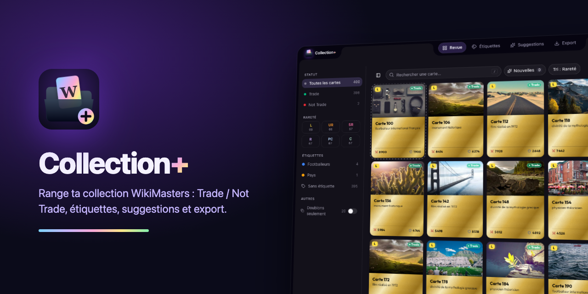
</p>

<p align="center">
  <a href="https://github.com/EnzoBncll/wikimasters-collection-plus/releases/latest"></a>
  
  <a href="LICENSE"></a>
</p>

# WikiMasters Collection+

> Extension Chrome **non officielle** pour [WikiMasters](https://www.wiki-masters.com), sans lien avec l'équipe du jeu.

Range ta collection de cartes Wikipédia : tri **Trade / Not Trade** en quelques clics, **étiquettes** (celles du site), **albums** à feuilleter façon Panini, **liste de souhaits** avec suggestions des meilleures cartes à chercher, et **export** CSV / Google Sheets.

<p align="center">
  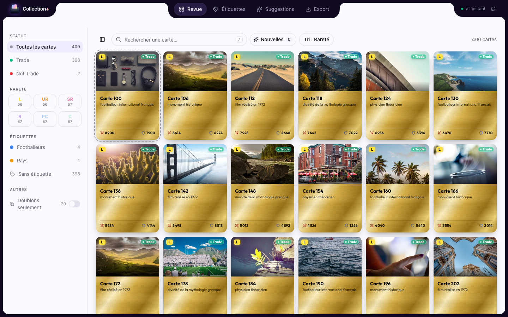
  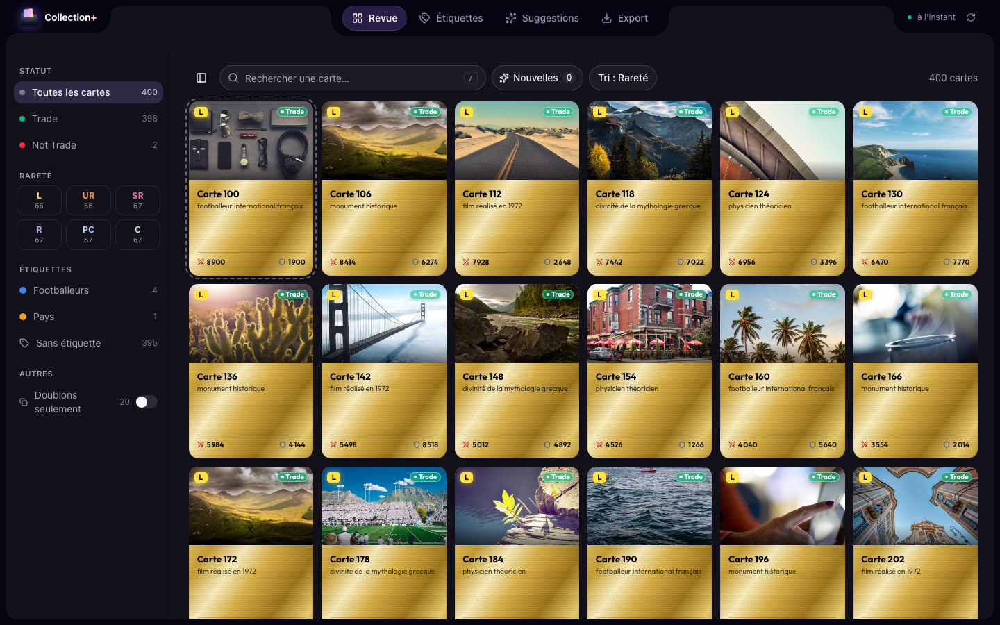
</p>

## Fonctionnalités

- **Revue** : toutes tes cartes, filtres (statut, rareté, étiquettes, doublons, nouvelles), sélection multiple, raccourcis clavier (`T` Trade, `N` Not Trade, `E` étiqueter, `A` tout, `/` recherche, `Entrée` afficher en grand).
- **Cartes au style WikiMasters** : format, couleurs de rareté et statistiques du jeu, papier légèrement grainé ; reflet holographique au survol, plus intense selon la rareté. Les **Ultra rares** ont un irisé qui bouge en permanence, les **Légendaires** une vraie feuille d'or avec un éclat qui la balaie.
- **Carte en grand** : clic sur une carte (double-clic dans la Revue) pour l'afficher en grand avec ses infos, ← → pour parcourir.
- **Trade / Not Trade** : deux étiquettes natives du site, option « tout Trade par défaut », pastilles sur les cartes de WikiMasters.
- **Étiquettes** : en dossiers animés ou en liste, couleurs, renommage ; tout est visible sur le site.
- **Albums** : chaque étiquette s'ouvre en album à feuilleter, **relié** (toile, tranches de pages, papier) ou **classeur** (pochettes plastique, anneaux). On tourne les pages en les faisant glisser et on range les cartes case par case.
- **Liste de souhaits et suggestions** : sous chaque album, Collection+ devine le thème (métier, pays, genre…) et propose les cartes les plus connues de ce thème que tu n'as pas encore ; un ♡ les garde dans la liste de souhaits de l'album.
- **Suggestions d'étiquettes** : Collection+ reconnaît ce que représente chaque carte (personnalité, film, ville, espèce, footballeur…) et propose des étiquettes en un clic. Règles optionnelles pour les futures cartes, **à valider** ou **automatiques**.
- **Export** : CSV, copie pour tableur, ou classeur Google Sheets mis en forme.
- **Thèmes** : mode clair, sombre ou auto, et 10 palettes qui recolorent l'interface, le bouton sur le site et l'icône de l'extension.
- **Cache local** : la collection s'affiche instantanément, seuls les changements sont rechargés.

## Cartes et raretés

Au repos (en haut) et au survol (en bas), de Commun à Légendaire :

<p align="center">
  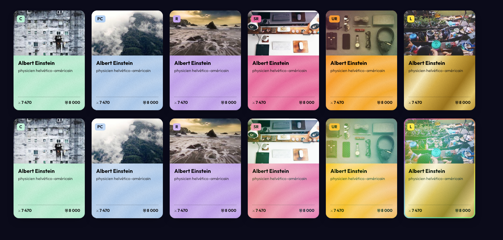
</p>

<p align="center">
  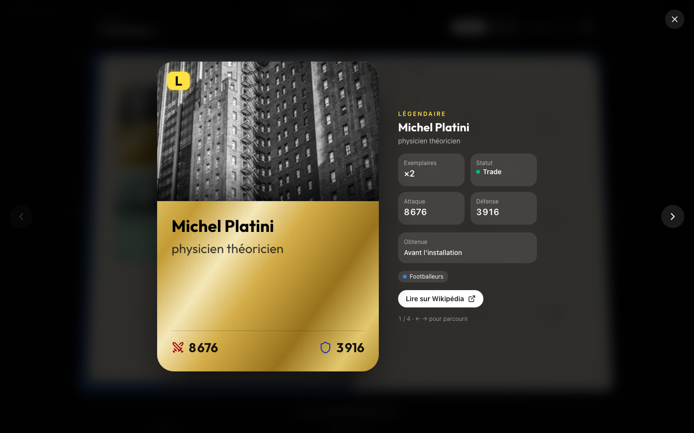
</p>

## Albums

<p align="center">
  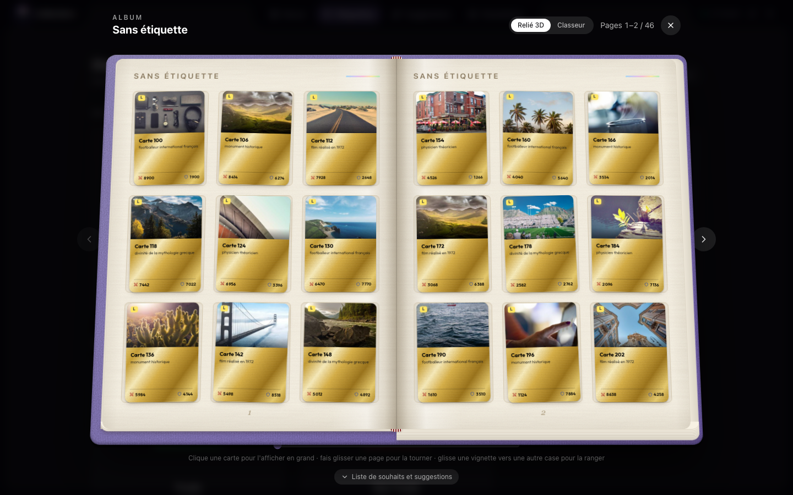
  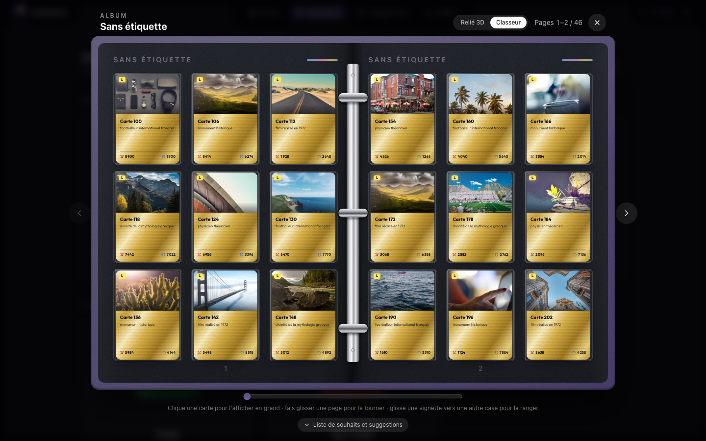
</p>

Sous chaque album, la liste de souhaits et les **meilleures cartes à chercher** pour son thème, classées par notoriété (nombre d'éditions de Wikipédia : plus un article est lu, plus la carte est rare).

<p align="center">
  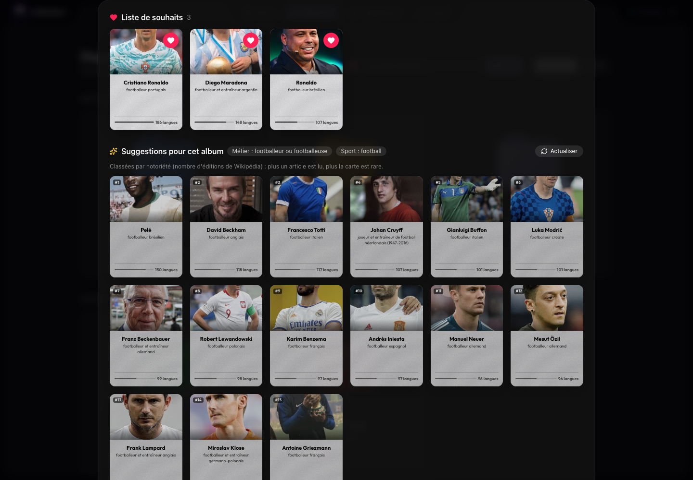
</p>

<p align="center">
  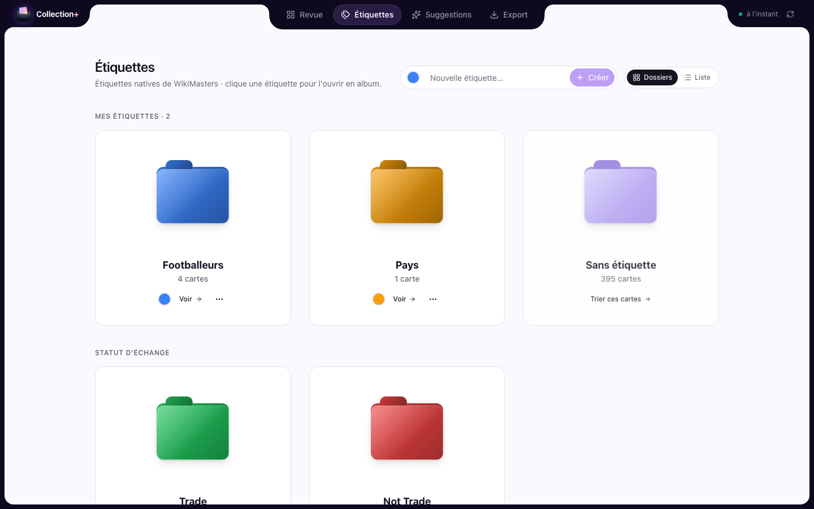
  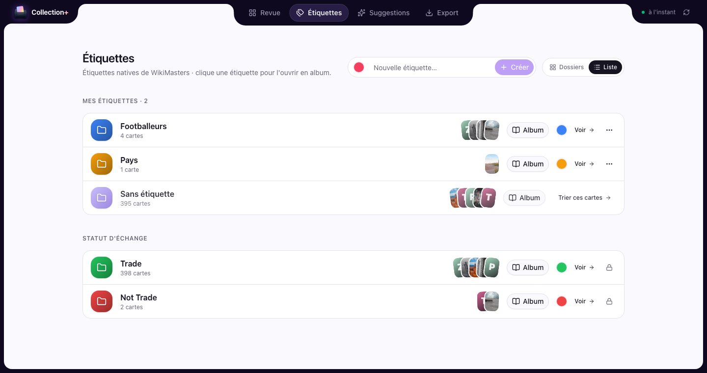
</p>

## Palettes

Dix accords de couleurs, à choisir dans **Export → Réglages → Palette**. Chacun existe en clair et en sombre.

<p align="center">
  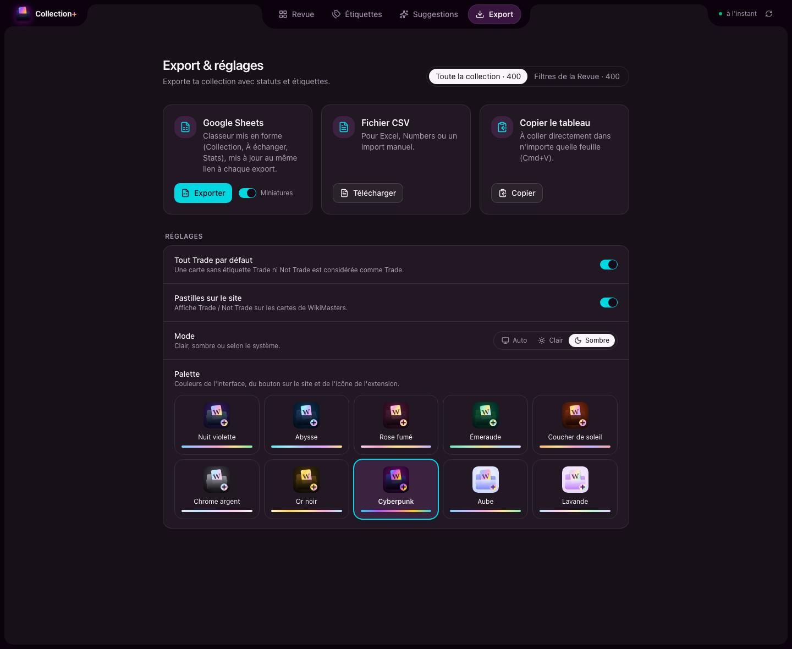
</p>

<p align="center">
  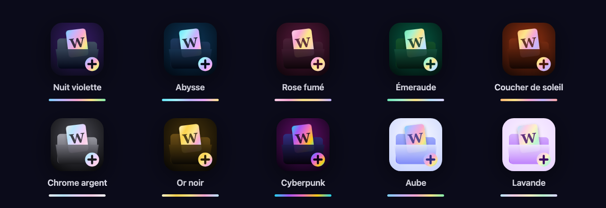
</p>

<p align="center">
  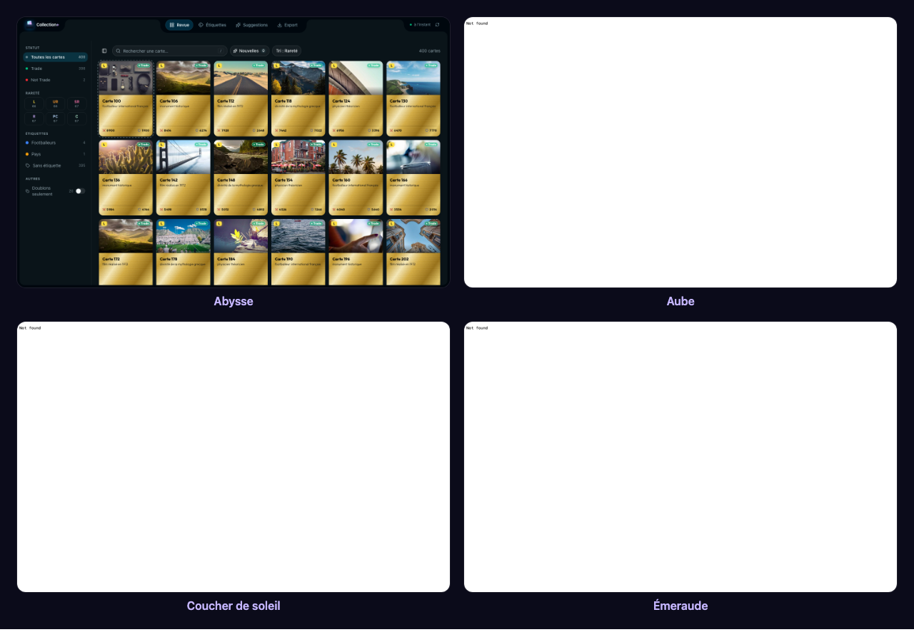
</p>

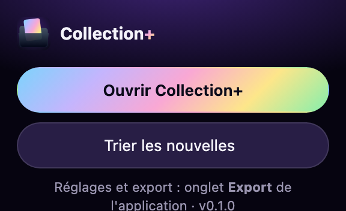

**Popup et bouton sur le site** : un clic sur l'icône ouvre Collection+ ou trie directement les nouvelles cartes. Sur WikiMasters, le bouton **Collection+** en bas à gauche indique combien de cartes attendent d'être triées.

<br clear="right">

## Installation

1. Télécharge le zip de la [dernière version](https://github.com/EnzoBncll/wikimasters-collection-plus/releases/latest) (`wikimasters-collection-plus-x.y.z-chrome.zip`).
2. Dézippe-le dans un dossier que tu gardes (ex. `Documents/Collection+`).
3. Ouvre `chrome://extensions`, active le **Mode développeur** (en haut à droite).
4. **Charger l'extension non empaquetée** → choisis le dossier dézippé.
5. Va sur WikiMasters (connecté) : un bouton **Collection+** apparaît en bas à gauche.

> Garde un onglet WikiMasters ouvert quand tu utilises Collection+ : l'extension passe par lui pour parler au site.

## Mises à jour

Collection+ vérifie les nouvelles versions et affiche **« Version x.y.z disponible »** dans l'app et le popup. Pour mettre à jour :

1. Télécharge le nouveau zip depuis la [page des versions](https://github.com/EnzoBncll/wikimasters-collection-plus/releases/latest).
2. Remplace le contenu de ton dossier par celui du nouveau zip.
3. Dans `chrome://extensions`, clique sur **↻ Recharger** sous Collection+.

Tes réglages, règles et données restent en place (l'identifiant de l'extension est fixe).

## Confidentialité

Aucun serveur, aucune collecte : voir [PRIVACY.md](PRIVACY.md). Les suggestions interrogent Wikidata et Wikipédia (API publiques, sans compte).

---

## Développement

```bash
pnpm install
pnpm dev            # Chrome avec l'extension en rechargement à chaud
pnpm build          # build de production → .output/chrome-mv3
pnpm preview:mock   # aperçu dans un navigateur, avec données simulées
pnpm typecheck
pnpm icons          # régénère les PNG de l'icône (public/icon) depuis lib/brand-icon.ts
pnpm readme:assets  # régénère les images du README (docs/images) depuis l'aperçu simulé
```

Charte : `lib/palettes.ts` (les 10 palettes et leurs variables CSS) et `lib/brand-icon.ts` (l'icône en SVG). Les deux scripts ci-dessus utilisent Chromium en headless (`CHROME=/chemin/vers/chrome` pour en choisir un).

Stack : WXT (MV3) · React 19 · Tailwind v4 · shadcn/ui (`components/ui`) · framer-motion · zustand · TanStack Virtual.

### Publier une version

```bash
npm version patch   # ou minor / major : met à jour package.json, commit + tag vX.Y.Z
git push --follow-tags
```

Le workflow [Release](.github/workflows/release.yml) construit le zip et crée la Release GitHub ; les extensions installées la détectent.

### Export Google Sheets (optionnel)

1. [Google Cloud Console](https://console.cloud.google.com) → nouveau projet → activer **Google Sheets API**.
2. **Écran de consentement OAuth** (externe) → ajouter les comptes testeurs.
3. **Identifiants → ID client OAuth** → type **Extension Chrome**, ID de l'élément : `npnhlblglinajejkkjcigeebgbogpbii`.
4. En local : `WXT_GOOGLE_CLIENT_ID=…` dans `.env.local`. Pour les Releases : variable de dépôt `WXT_GOOGLE_CLIENT_ID` (Settings → Secrets and variables → Actions → Variables).

### Cache et synchronisation

- Collection en cache (`chrome.storage.local`) ; à l'ouverture, vérification légère (`/api/my-collection/stats` + étiquettes).
- Rechargement complet si le site a modifié la collection (paquet, échange, marché… détecté automatiquement), si les stats changent, si le cache a plus de 6 h, ou via ↻.

## Licence

[MIT](LICENSE)
